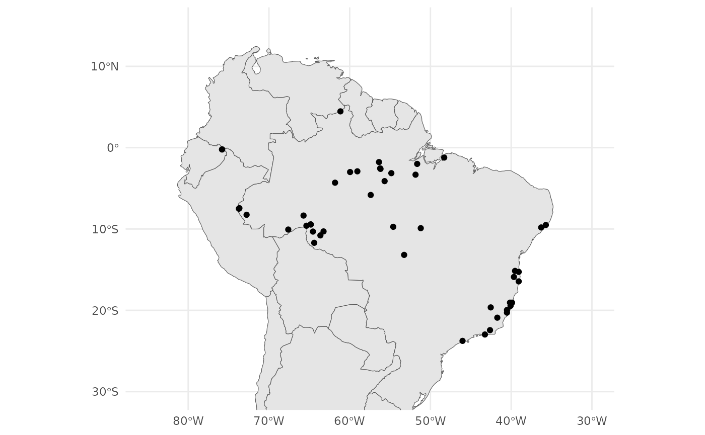
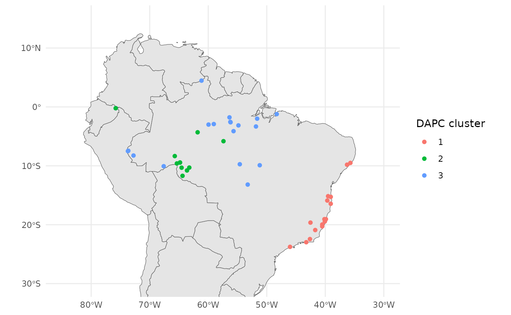

# Population genetic analysis with tidypopgen

### An example workflow with real data

We will explore the genetic structure of *Anolis punctatus* in South
America, using data from Prates et al 2018. We downloaded the vcf file
of the genotypes from
“<https://github.com/ivanprates/2018_Anolis_EcolEvol/blob/master/data/VCFtools_SNMF_punctatus_t70_s10_n46/punctatus_t70_s10_n46_filtered.recode.vcf?raw=true>”
and compressed it to a vcf.gz file.

We read in the data from the compressed vcf with:

``` r
library(tidypopgen)
#> Loading required package: dplyr
#> 
#> Attaching package: 'dplyr'
#> The following objects are masked from 'package:stats':
#> 
#>     filter, lag
#> The following objects are masked from 'package:base':
#> 
#>     intersect, setdiff, setequal, union
#> Loading required package: tibble
vcf_path <-
  system.file("/extdata/anolis/punctatus_t70_s10_n46_filtered.recode.vcf.gz",
    package = "tidypopgen"
  )
anole_gt <-
  gen_tibble(vcf_path, quiet = TRUE, backingfile = tempfile("anolis_"))
```

Now let’s inspect our `gen_tibble`:

``` r
anole_gt
#> # A gen_tibble: 3249 loci
#> # A tibble:     46 × 2
#>    id                 genotypes
#>    <chr>             <vctr_SNP>
#>  1 punc_BM288         [0,0,...]
#>  2 punc_GN71          [2,0,...]
#>  3 punc_H1907         [0,2,...]
#>  4 punc_H1911         [0,2,...]
#>  5 punc_H2546         [0,1,...]
#>  6 punc_IBSPCRIB0361  [0,0,...]
#>  7 punc_ICST764       [0,0,...]
#>  8 punc_JFT459        [0,0,...]
#>  9 punc_JFT773        [0,0,...]
#> 10 punc_LG1299        [0,0,...]
#> # ℹ 36 more rows
```

We can see that we have 46 individuals, from 3249 loci. Note that we
don’t have any information on population from the vcf. That information
can be found from another csv file. We will have add the population
information manually. Let’s start by reading the file:

``` r
pops_path <- system.file("/extdata/anolis/punctatus_n46_meta.csv",
  package = "tidypopgen"
)
pops <- read.csv(pops_path)
pops
#>                   id       population longitude latitude pop
#> 1         punc_BM288 Amazonian_Forest  -51.8448  -3.3228 Eam
#> 2          punc_GN71 Amazonian_Forest  -54.6064  -9.7307 Eam
#> 3         punc_H1907 Amazonian_Forest  -64.8247  -9.4459 Wam
#> 4         punc_H1911 Amazonian_Forest  -64.8203  -9.4358 Wam
#> 5         punc_H2546 Amazonian_Forest  -65.3576  -9.5979 Wam
#> 6  punc_IBSPCRIB0361  Atlantic_Forest  -46.0247 -23.7564  AF
#> 7       punc_ICST764  Atlantic_Forest  -36.2838  -9.8092  AF
#> 8        punc_JFT459  Atlantic_Forest  -40.5219 -20.2811  AF
#> 9        punc_JFT773  Atlantic_Forest  -40.5200 -19.9600  AF
#> 10       punc_LG1299  Atlantic_Forest  -39.0694 -15.2696  AF
#> 11  punc_LSUMZH12577 Amazonian_Forest  -75.8069  -0.2172 Wam
#> 12  punc_LSUMZH12751 Amazonian_Forest  -75.8069  -0.2172 Wam
#> 13  punc_LSUMZH13910 Amazonian_Forest  -72.7677  -8.2509 Eam
#> 14  punc_LSUMZH14100 Amazonian_Forest  -65.7161  -8.3464 Wam
#> 15  punc_LSUMZH14336 Amazonian_Forest  -54.8416  -3.1354 Eam
#> 16  punc_LSUMZH15476 Amazonian_Forest  -64.5500 -10.3167 Wam
#> 17    punc_MPEG20846 Amazonian_Forest  -56.1842  -2.6096 Eam
#> 18    punc_MPEG21348 Amazonian_Forest  -64.3915 -11.6996 Wam
#> 19    punc_MPEG22415 Amazonian_Forest  -48.2948  -1.2169 Eam
#> 20    punc_MPEG24758 Amazonian_Forest  -56.3706  -1.7731 Eam
#> 21    punc_MPEG26102 Amazonian_Forest  -51.6418  -1.9969 Eam
#> 22    punc_MPEG28489 Amazonian_Forest  -56.2256  -2.5475 Eam
#> 23    punc_MPEG29314 Amazonian_Forest  -59.0495  -2.9096 Eam
#> 24    punc_MPEG29943 Amazonian_Forest  -55.6771  -4.1144 Eam
#> 25     punc_MTR05978  Atlantic_Forest  -39.5233 -15.1547  AF
#> 26     punc_MTR12338  Atlantic_Forest  -40.0804 -19.4483  AF
#> 27     punc_MTR12511  Atlantic_Forest  -39.8942 -19.0564  AF
#> 28     punc_MTR15267  Atlantic_Forest  -42.6216 -22.4354  AF
#> 29     punc_MTR17744  Atlantic_Forest  -42.5333 -19.6411  AF
#> 30     punc_MTR18550 Amazonian_Forest  -61.8135  -4.3074 Wam
#> 31     punc_MTR20798 Amazonian_Forest  -61.1451   4.4621 Eam
#> 32     punc_MTR21474 Amazonian_Forest  -59.9494  -2.9979 Eam
#> 33     punc_MTR21545  Atlantic_Forest  -40.1473 -19.0556  AF
#> 34     punc_MTR25584 Amazonian_Forest  -63.6281 -10.7868 Wam
#> 35     punc_MTR28048 Amazonian_Forest  -73.6575  -7.4424 Eam
#> 36     punc_MTR28401 Amazonian_Forest  -73.7214  -7.5016 Eam
#> 37     punc_MTR28593 Amazonian_Forest  -67.6063 -10.0679 Eam
#> 38     punc_MTR34227  Atlantic_Forest  -39.6611 -15.8958  AF
#> 39     punc_MTR34414  Atlantic_Forest  -39.0700 -16.4420  AF
#> 40    punc_MTR976723 Amazonian_Forest  -53.2564 -13.1833 Eam
#> 41    punc_MTR978312 Amazonian_Forest  -51.2000  -9.9000 Eam
#> 42     punc_MTRX1468  Atlantic_Forest  -41.7192 -20.9031  AF
#> 43     punc_MTRX1478  Atlantic_Forest  -43.2547 -22.9712  AF
#> 44    punc_MUFAL9635  Atlantic_Forest  -35.7099  -9.5073  AF
#> 45       punc_PJD409 Amazonian_Forest  -57.3956  -5.8174 Wam
#> 46   punc_UNIBAN1670 Amazonian_Forest  -63.2375 -10.2987 Wam
```

We can now attempt to join the tables. We recommend using a `left_join`
to do so, rather than `cbind` or `bind_cols`, as the latter functions
assume that the two tables are in the same order. In this case, we do
not want to bring over the wrong data due to mismatched ordering.

``` r
anole_gt <- anole_gt %>% left_join(pops, by = "id")
```

Let us check that we have been successful:

``` r
anole_gt %>% glimpse()
#> Rows: 46
#> Columns: 6
#> A tibble: 46 × 6
#> $ id         <chr> "punc_BM288", "punc_GN71", "punc_H1907", "punc_H1911", "pun…
#> $ genotypes  <vctr_SNP> [0,0,...], [2,0,...], [0,2,...], [0,2,...], [0,1,...],…
#> $ population <chr> "Amazonian_Forest", "Amazonian_Forest", "Amazonian_Forest",…
#> $ longitude  <dbl> -51.8448, -54.6064, -64.8247, -64.8203, -65.3576, -46.0247,…
#> $ latitude   <dbl> -3.3228, -9.7307, -9.4459, -9.4358, -9.5979, -23.7564, -9.8…
#> $ pop        <chr> "Eam", "Eam", "Wam", "Wam", "Wam", "AF", "AF", "AF", "AF", …
```

### Map

Lets begin by visualising our samples geographically. We have latitudes
and longitudes in our tibble; we can transform them into an `sf`
geometry with the function
[`gt_add_sf()`](https://evolecolgroup.github.io/tidypopgen/reference/gt_add_sf.md).
Once we have done that, our `gen_tibble` will act as an `sf` object,
which can be plotted with `ggplot2`.

``` r
anole_gt <- gt_add_sf(anole_gt, c("longitude", "latitude"))
anole_gt
#> Simple feature collection with 46 features and 6 fields
#> Geometry type: POINT
#> Dimension:     XY
#> Bounding box:  xmin: -75.8069 ymin: -23.7564 xmax: -35.7099 ymax: 4.4621
#> Geodetic CRS:  WGS 84
#> # A gen_tibble: 3249 loci
#> # A tibble:     46 × 7
#>    id    genotypes population longitude latitude pop              geometry
#>    <chr> <vctr_SN> <chr>          <dbl>    <dbl> <chr>         <POINT [°]>
#>  1 punc… [0,0,...] Amazonian…     -51.8    -3.32 Eam    (-51.8448 -3.3228)
#>  2 punc… [2,0,...] Amazonian…     -54.6    -9.73 Eam    (-54.6064 -9.7307)
#>  3 punc… [0,2,...] Amazonian…     -64.8    -9.45 Wam    (-64.8247 -9.4459)
#>  4 punc… [0,2,...] Amazonian…     -64.8    -9.44 Wam    (-64.8203 -9.4358)
#>  5 punc… [0,1,...] Amazonian…     -65.4    -9.60 Wam    (-65.3576 -9.5979)
#>  6 punc… [0,0,...] Atlantic_…     -46.0   -23.8  AF    (-46.0247 -23.7564)
#>  7 punc… [0,0,...] Atlantic_…     -36.3    -9.81 AF     (-36.2838 -9.8092)
#>  8 punc… [0,0,...] Atlantic_…     -40.5   -20.3  AF    (-40.5219 -20.2811)
#>  9 punc… [0,0,...] Atlantic_…     -40.5   -20.0  AF        (-40.52 -19.96)
#> 10 punc… [0,0,...] Atlantic_…     -39.1   -15.3  AF    (-39.0694 -15.2696)
#> # ℹ 36 more rows
```

To visualise our samples, we can create a map of South America using the
`rnaturalearth` package. We will use the
[`ne_countries()`](https://docs.ropensci.org/rnaturalearth/reference/ne_countries.html)
function to get the countries in South America. We will then plot the
map and add our samples using the
[`geom_sf()`](https://ggplot2.tidyverse.org/reference/ggsf.html)
function from `ggplot2`.

``` r
library(rnaturalearth)
library(ggplot2)

map <- ne_countries(
  continent = "South America",
  type = "map_units", scale = "medium"
)

ggplot() +
  geom_sf(data = map) +
  geom_sf(data = anole_gt$geometry) +
  coord_sf(
    xlim = c(-85, -30),
    ylim = c(-30, 15)
  ) +
  theme_minimal()
```



From our map we can see that we have samples from the coastal Atlantic
Forest and the Amazonian Forest.

### PCA

That was easy. The loci had already been filtered and cleaned, so we
don’t need to do any QC. Let us jump straight into analysis and run a
PCA:

``` r
anole_pca <- anole_gt %>% gt_pca_partialSVD(k = 30)
#> Error: You can't have missing values in 'X'.
```

OK, we jumped too quickly. There are missing data, and we need first to
impute them:

``` r
anole_gt <- gt_impute_simple(anole_gt, method = "mode")
```

And now:

``` r
anole_pca <- anole_gt %>% gt_pca_partialSVD(k = 30)
```

Let us look at the object:

``` r
anole_pca
#>  === PCA of gen_tibble object ===
#> Method: [1] "partialSVD"
#> 
#> Call ($call):gt_pca_partialSVD(x = ., k = 30)
#> 
#> Eigenvalues ($d):
#>  351.891 192.527 113.562 104.427 87.615 83.476 ...
#> 
#> Principal component scores ($u):
#>  matrix with 46 rows (individuals) and 30 columns (axes) 
#> 
#> Loadings (Principal axes) ($v):
#>  matrix with 3249 rows (SNPs) and 30 columns (axes)
```

The `print` function (implicitly called when we type the name of the
object) gives us information about the most important elements in the
object (and the names of the elements in which they are stored).

We can extract those elements with the `tidy` function, which returns a
tibble that can be easily used for further analysis, e.g.:

``` r
tidy(anole_pca, matrix = "eigenvalues")
#> # A tibble: 30 × 4
#>       PC std.dev percent cumulative
#>    <int>   <dbl>   <dbl>      <dbl>
#>  1     1   52.5    45.9        45.9
#>  2     2   28.7    13.7        59.7
#>  3     3   16.9     4.78       64.5
#>  4     4   15.6     4.05       68.5
#>  5     5   13.1     2.85       71.4
#>  6     6   12.4     2.58       73.9
#>  7     7   10.3     1.79       75.7
#>  8     8   10.0     1.68       77.4
#>  9     9    9.23    1.42       78.8
#> 10    10    8.90    1.32       80.2
#> # ℹ 20 more rows
```

We can return information on the *eigenvalues*, *scores* and *loadings*
of the pca. There is also an `autoplot` method that allows to visualise
those elements (type *screeplot* for *eigenvalues*, type *scores* for
*scores*, and *loadings* for *loadings*:

``` r
autoplot(anole_pca, type = "screeplot")
```


To plot the sample in principal coordinates space, we can simply use:

``` r
autoplot(anole_pca, type = "scores")
```


`autoplots` are deliberately kept simple: they are just a way to quickly
inspect the results. To explore additional dimensions, we can use the
`k` argument:

``` r
autoplot(anole_pca, type = "scores", k = c(1, 3))
```


The autoplots generate `ggplot2` objects, and so they can be further
embellished with the usual `ggplot2` grammar:

``` r
library(ggplot2)
autoplot(anole_pca, type = "scores") +
  aes(color = anole_gt$population) +
  labs(color = "population")
```


For more complex/publication ready plots, we will want to add the PC
scores to the tibble, so that we can create a custom plot with
`ggplot2`. We can easily add the data with the `augment` method:

``` r
anole_gt <- augment(anole_pca, data = anole_gt)
```

And now we can use `ggplot2` directly to generate our plot:

``` r
anole_gt %>% ggplot(aes(.fittedPC1, .fittedPC2, color = population)) +
  geom_point() +
  labs(x = "PC1", y = "PC2", color = "Population")
```


We can see that the two population separate clearly in the PCA space,
with individuals from the Atlantic Forest clustering closely together
while Amazonian Forest individuals are spread across the first two
principal components.

It is also possible to inspect which loci contribute the most to a given
component:

``` r
autoplot(anole_pca, type = "loadings")
```


By using information from the loci table, we could easily embellish the
plot, for example colouring by chromosome or maf.

For more complex plots, we can augment the loci table with the loadings
using
[`augment_loci()`](https://evolecolgroup.github.io/tidypopgen/reference/augment_loci.md):

``` r
anole_gt_load <- augment_loci(anole_pca, data = anole_gt)
```

## Explore population structure with DAPC

DAPC is a powerful tool to investigate population structure. It has the
advantage of scaling well to very large datasets. It does not have the
assumptions of STRUCTURE or ADMIXTURE (which also limits its power).

The first step is to determine the number of genetic clusters in the
dataset. DAPC can be either used to test a a-priori hypothesis, or we
can use the data to suggest the number of clusters. In this case, we did
not have any strong expectations of structure in our study system, so we
will let the data inform the number of possible genetic clusters. We
will use a k-clustering algorithm applied to the principal components
(allowing us to reduce the dimensions from the thousands of loci to just
a few tens of components). We need to decide how many components to use;
this decision is often made based on a plot of the cumulative explained
variance of the components. Using `tidy` on the `gt_pca` object allows
us easily obtain those quantities, and it is then trivial to plot them:

``` r
library(ggplot2)
tidy(anole_pca, matrix = "eigenvalues") %>%
  ggplot(mapping = aes(x = PC, y = cumulative)) +
  geom_point()
```


Note that, as we were working with a truncated SVD algorithm for our
PCA, we can not easily phrase the eigenvalues in terms of proportion of
total variance, so the cumulative y axis simply shows the cumulative sum
of the eigenvalues. Ideally, we are looking for the point where the
curve starts flattening. In this case, we can not see a very clear
flattening, but by PC 10 the increase in explained variance has markedly
decelerated. We can now find clusters based on those 10 PCs:

``` r
anole_clusters <- gt_cluster_pca(anole_pca, n_pca = 10)
```

As we did not define the *k* values to explore, the default 1 to 5 was
used (we can change that by setting the `k` parameter to change the
range). To choose an appropriate *k*, we plot the number of clusters
against a measure of fit. BIC has been shown to be a very good metric
under many scenarios:

``` r
autoplot(anole_clusters)
```


We are looking for the minimum value of BIC. There is no clear elbow (a
minimum after which BIC increases with increasing k). However, we notice
that there is a quick levelling off in the decrease in BIC at 3
clusters. Arguably, these are sufficient to capture the main structure.
We can also use a number of algorithmic approaches (based on the
original
[`find.clusters()`](https://rdrr.io/pkg/adegenet/man/find.clusters.html)
function in `adegenet`) to choose the best *k* value from this plot
through
[`gt_cluster_pca_best_k()`](https://evolecolgroup.github.io/tidypopgen/reference/gt_cluster_pca_best_k.md).
We will use the defaults (BIC with “diffNgroup”, see the help page for
[`gt_cluster_pca_best_k()`](https://evolecolgroup.github.io/tidypopgen/reference/gt_cluster_pca_best_k.md)
for a description of the various options):

``` r
anole_clusters <- gt_cluster_pca_best_k(anole_clusters)
#> Using BIC with criterion diffNgroup: 3 clusters
```

The algorithm confirms our choice. Note that this function simply adds
an element `$best_k` to the `gt_cluster_pca` object:

``` r
anole_clusters$best_k
#> [1] 3
```

If we decided that we wanted to explore a different value, we could
simply overwrite that number with `anole_clusters$best_k<-5`

In this case, we are happy with the option of 3 clusters, and we can run
a DAPC:

``` r
anole_dapc <- gt_dapc(anole_clusters)
```

Note that
[`gt_dapc()`](https://evolecolgroup.github.io/tidypopgen/reference/gt_dapc.md)
takes automatically the number of clusters from the `anole_clusters`
object, but can change that behaviour by setting some of its parameters
(see the help page for
[`gt_dapc()`](https://evolecolgroup.github.io/tidypopgen/reference/gt_dapc.md)).
When we print the object, we are given information about the most
important elements of the object and where to find them (as we saw for
`gt_pca`):

``` r
anole_dapc
#>  === DAPC of gen_tibble object ===
#> Call ($call):gt_dapc(x = anole_clusters)
#> 
#> Eigenvalues ($eig):
#>  727.414 218.045 
#> 
#> LD scores ($ind.coord):
#>  matrix with 46 rows (individuals) and 2 columns (LD axes) 
#> 
#> Loadings by PC ($loadings):
#>  matrix with 2 rows (PC axes) and 2 columns (LD axes) 
#> 
#> Loadings by locus($var.load):
#>  matrix with 3249 rows (loci) and 2 columns (LD axes)
```

Again, these elements can be obtained with tidiers (with `matrix` equal
to `eigenvalues`, `scores`,`ld_loadings` and `loci_loadings`):

``` r
tidy(anole_dapc, matrix = "eigenvalues")
#> # A tibble: 2 × 3
#>      LD eigenvalue cumulative
#>   <int>      <dbl>      <dbl>
#> 1     1       727.       727.
#> 2     2       218.       945.
```

And they can be visualised with `autoplot`:

``` r
autoplot(anole_dapc, type = "screeplot")
```


As for pca, there is a `tidy` method that can be used to extract
information from `gt_dapc` objects. For example, if we want to create a
bar plot of the eigenvalues (since we only have two), we could simply
use:

``` r
tidy(anole_dapc, matrix = "eigenvalues") %>%
  ggplot(aes(x = LD, y = eigenvalue)) +
  geom_col()
```


We can plot the scores with:

``` r
autoplot(anole_dapc, type = "scores")
```


The DAPC plot shows the separation of individuals into 3 clusters.

We can inspect this assignment by DAPC with `autoplot` using the type
`components`, ordering the samples by their original population labels:

``` r
autoplot(anole_dapc, type = "components", group = anole_gt$population)
#> Warning in ggplot2::geom_col(color = "gray", size = 0.1): Ignoring
#> unknown parameters: `size`
```


Here we can see that DAPC splits the Amazonian Forest individuals into
two clusters. Because of the very clear separation we observed when
plotting the LD scores, no individual is modelled as a mixture: all
assignments are with 100% probability to a single cluster.

Finally, we can explore which loci have the biggest impact on separating
the clusters (either because of drift or selection):

``` r
autoplot(anole_dapc, "loadings")
```


There is no strong outlier, suggesting drift across many loci has
created the signal picked up by DAPC.

Note that `anole_dapc` is of class `gt_dapc`, which is a subclass of
`dapc` from `adegenet`. This means that functions written to work on
`dapc` objects should work out of the box (the only exception is
[`adegenet::predict.dapc`](https://rdrr.io/pkg/adegenet/man/dapc.html),
which does not work because the underlying pca object is different). For
example, we can obtain the standard dapc plot with:

``` r
library(adegenet)
#> Loading required package: ade4
#> 
#>    /// adegenet 2.1.11 is loaded ////////////
#> 
#>    > overview: '?adegenet'
#>    > tutorials/doc/questions: 'adegenetWeb()' 
#>    > bug reports/feature requests: adegenetIssues()
scatter(anole_dapc, posi.da = "bottomright")
```


We can also plot these results onto the map we created earlier.

``` r
anole_gt <- anole_gt %>% mutate(dapc = anole_dapc$grp)

ggplot() +
  geom_sf(data = map) +
  geom_sf(data = anole_gt$geometry, aes(color = anole_gt$dapc)) +
  coord_sf(
    xlim = c(-85, -30),
    ylim = c(-30, 15)
  ) +
  labs(color = "DAPC cluster") +
  theme_minimal()
```



Atlantic forest lizards form distinct geographic cluster, separate from
the Amazonian lizards.

## Clustering with ADMIXTURE

ADMIXTURE is a fast clustering algorithm which provides results similar
to STRUCTURE. We can run it directly from tidypopgen using the
`gt_admixture` function.

The output of `gt_admixture` is a `gt_admix` object. `gt_admix` objects
are designed to make visualising data from different clustering
algorithms swift and easy.

Lets begin by running `gt_admixture`. We can run K clusters from k=2 to
k=6. We will use just one repeat, but ideally we should run multiple
repetitions for each K:

``` r
anole_gt <- anole_gt %>% group_by(population)

anole_adm_original <- gt_admixture(
  x = anole_gt,
  k = 2:6,
  n_runs = 1,
  crossval = TRUE,
  seed = 1
)
```

Note that within this vignette we are not running the `gt_admixture`
function, as it requires the ADMIXTURE software to be installed on your
machine and available in your PATH. Instead, we load the results from a
previous run of ADMIXTURE. If you would prefer a native clustering
algorithm, we recommend using the `gt_snmf` function, which is a wrapper
for the `snmf` function from the `LEA` package. sNMF is a fast
clustering algorithm which provides results similar to STRUCTURE and
ADMIXTURE, and is available directly using the `tidypopgen` package. We
can examine the suitability of our K values by plotting the
cross-entropy values for each K value, which is contained in the `cv`
element of the `gt_admix` object:

``` r
autoplot(anole_adm, type = "cv")
```


Here we can see that K = 3 is a sensible choice, as K = 3 represents the
‘elbow’ in the plot, where cross-entropy is at it’s lowest.

We can quickly plot this data with `autoplot` by using the type
`barplot` and selecting our chosen value of `k`:

``` r
autoplot(anole_adm,
  k = 3, run = 1, data = anole_gt, annotate_group = FALSE,
  type = "barplot"
)
```


This plot is fine, but it is messy, and not a very helpful visualisation
if we want to understand how our populations are structured.

To re-order this plot, grouping individuals by population, we can use
the `annotate_group` and `arrange_by_group` arguments in autoplot:

``` r
autoplot(anole_adm,
  type = "barplot", k = 3, run = 1, data = anole_gt,
  annotate_group = TRUE, arrange_by_group = TRUE
)
```


This plot is much better. Now the plot is labelled by population we can
see that the individuals from each population are grouped together, with
a few individuals showing mixed ancestry between populations.

However, for a more visually appealing plot, we can re-order the
individuals within each population as follows:

``` r
autoplot(anole_adm,
  type = "barplot", k = 3, run = 1,
  data = anole_gt, annotate_group = TRUE, arrange_by_group = TRUE,
  arrange_by_indiv = TRUE, reorder_within_groups = TRUE
)
```


Now individuals are neatly ordered within each population.

For more complex/publication ready plots, we can extract the specific K
value and run that we are interested in plotting, and add this .Q matrix
to our gen_tibble object, so that we can create a custom plot with
`ggplot2`.

First we extract the q_matrix of interest using the `get_q_matrix`
function:

``` r
q_mat <- get_q_matrix(anole_adm, k = 3, run = 1)
```

Then we can easily add the data with the `augment` method:

``` r
anole_gt_adm <- augment(q_mat, data = anole_gt)
head(anole_gt_adm)
#> Simple feature collection with 6 features and 42 fields
#> Geometry type: POINT
#> Dimension:     XY
#> Bounding box:  xmin: -65.3576 ymin: -23.7564 xmax: -46.0247 ymax: -3.3228
#> Geodetic CRS:  WGS 84
#> # A tibble: 6 × 43
#> # Groups:   population [2]
#>   id     genotypes population longitude latitude pop              geometry
#>   <chr>  <vctr_SN> <chr>          <dbl>    <dbl> <chr>         <POINT [°]>
#> 1 punc_… [0,0,...] Amazonian…     -51.8    -3.32 Eam    (-51.8448 -3.3228)
#> 2 punc_… [2,0,...] Amazonian…     -54.6    -9.73 Eam    (-54.6064 -9.7307)
#> 3 punc_… [0,2,...] Amazonian…     -64.8    -9.45 Wam    (-64.8247 -9.4459)
#> 4 punc_… [0,2,...] Amazonian…     -64.8    -9.44 Wam    (-64.8203 -9.4358)
#> 5 punc_… [0,1,...] Amazonian…     -65.4    -9.60 Wam    (-65.3576 -9.5979)
#> 6 punc_… [0,0,...] Atlantic_…     -46.0   -23.8  AF    (-46.0247 -23.7564)
#> # ℹ 36 more variables: .rownames <chr>, .fittedPC1 <dbl>, .fittedPC2 <dbl>,
#> #   .fittedPC3 <dbl>, .fittedPC4 <dbl>, .fittedPC5 <dbl>, .fittedPC6 <dbl>,
#> #   .fittedPC7 <dbl>, .fittedPC8 <dbl>, .fittedPC9 <dbl>, .fittedPC10 <dbl>,
#> #   .fittedPC11 <dbl>, .fittedPC12 <dbl>, .fittedPC13 <dbl>, .fittedPC14 <dbl>,
#> #   .fittedPC15 <dbl>, .fittedPC16 <dbl>, .fittedPC17 <dbl>, .fittedPC18 <dbl>,
#> #   .fittedPC19 <dbl>, .fittedPC20 <dbl>, .fittedPC21 <dbl>, .fittedPC22 <dbl>,
#> #   .fittedPC23 <dbl>, .fittedPC24 <dbl>, .fittedPC25 <dbl>, …
```

Alternatively, we can convert our q matrix into `tidy` format, which is
more suitable for plotting:

``` r
tidy_q <- tidy(q_mat, anole_gt)
head(tidy_q)
#> # A tibble: 6 × 4
#>   id         group            q     percentage
#>   <chr>      <chr>            <chr>      <dbl>
#> 1 punc_BM288 Amazonian_Forest .Q1     0.000019
#> 2 punc_BM288 Amazonian_Forest .Q2     0.00001 
#> 3 punc_BM288 Amazonian_Forest .Q3     1.000   
#> 4 punc_GN71  Amazonian_Forest .Q1     0.00001 
#> 5 punc_GN71  Amazonian_Forest .Q2     0.00001 
#> 6 punc_GN71  Amazonian_Forest .Q3     1.000
```

And now we can use `ggplot2` directly to generate our custom plot:

``` r
tidy_q <- tidy_q %>%
  dplyr::group_by(id) %>%
  dplyr::mutate(dominant_q = max(percentage)) %>%
  dplyr::ungroup() %>%
  dplyr::arrange(group, dplyr::desc(dominant_q)) %>%
  dplyr::mutate(
    plot_order = dplyr::row_number(),
    id = factor(id, levels = unique(id))
  )

plt <- ggplot2::ggplot(tidy_q, ggplot2::aes(x = id, y = percentage, fill = q)) +
  ggplot2::geom_col(
    width = 1,
    position = ggplot2::position_stack(reverse = TRUE)
  ) +
  ggplot2::labs(
    y = "Population Structure for K = 3",
    title = "ADMIXTURE algorithm on A. punctatus"
  ) +
  theme_distruct() +
  scale_fill_distruct()

plt
```


In the Prates et al 2018 data, anolis lizards were assigned to three
regions, described as Af, Eam, and Wam, acronyms which correspond to the
Atlantic Forest, Eastern Amazonia, and Western Amazonia of Brazil. Our
metadata also contains this assignment, in the column `pop`.

Lets say we wanted to change the grouping variable of our plot to match
these regions. We can use the `gt_admix_reorder_q` function to reorder
the Q matrix by a different grouping variable:

``` r
anole_adm <- gt_admix_reorder_q(anole_adm, group = anole_gt$pop)
```

And replot the data:

``` r
autoplot(anole_adm,
  type = "barplot", k = 3, run = 1,
  annotate_group = TRUE, arrange_by_group = TRUE,
  arrange_by_indiv = TRUE, reorder_within_groups = TRUE
)
```


And here we can see the clear distinction between the three regions,
with a few individuals that have admixed ancestry.

## Handling Q matrices

For clustering algorithms that operate outside the R environment, the
function
[`q_matrix()`](https://evolecolgroup.github.io/tidypopgen/reference/q_matrix.md)
can take a path to a directory containing results from multiple runs of
a clustering algorithm for multiple values of K, read the .Q files, and
summarise them in a single `q_matrix_list` object.

In the analysis above, through `gt_admxiture()`, we ran 1 repetition for
K values 2 to 6. Let us now collate the results from a standard run of
ADMIXTURE for which we stored the files in a directory:

``` r
adm_dir <- file.path(tempdir(), "anolis_adm")
list.files(adm_dir)
#> [1] "K2run1.Q" "K3run1.Q" "K4run1.Q" "K5run1.Q" "K6run1.Q"
```

And read them back into our R environment using `q_matrix_list`:

``` r
q_list <- read_q_files(adm_dir)
summary(q_list)
#> Admixture results for multiple runs:           
#> k 2 3 4 5 6
#> n 1 1 1 1 1
#> with slots:
#> $Q for Q matrices
```

`q_matrix_list` has read and summarised the .Q files from our analysis,
and we can access a single matrix from the list by selecting the run
number and K value of interest using `get_q_matrix` as before.

For example, if we would like to view the second run of K = 3:

``` r
head(get_q_matrix(q_list, k = 3, run = 1))
#>           .Q1     .Q2      .Q3
#> [1,] 0.000019 0.00001 0.999971
#> [2,] 0.000010 0.00001 0.999980
#> [3,] 0.000010 0.99998 0.000010
#> [4,] 0.000010 0.99998 0.000010
#> [5,] 0.000010 0.99998 0.000010
#> [6,] 0.999980 0.00001 0.000010
```

And, again, we can then autoplot any matrix by selecting from the
`q_matrix_list` object:

``` r
autoplot(get_q_matrix(q_list, k = 3, run = 1),
  data = anole_gt,
  annotate_group = TRUE, arrange_by_group = TRUE,
  arrange_by_indiv = TRUE, reorder_within_groups = TRUE
)
```


In this way, `tidypopgen` integrates with external clustering software
seamlessly for quick, easy plotting.
