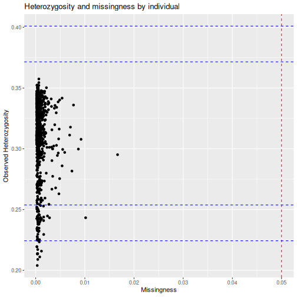
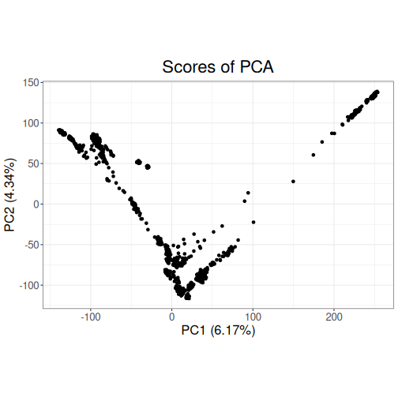

This vignette is a benchmark of a few key functions in the tidypopgen package.
The Human Genome Diversity Project (HGDP) SNP dataset is used for this
benchmark. This dataset includes 1043 individuals from 51 populations, typed
at ~650k loci.

We will run this benchmark on a machine with a GenuineIntel, Intel(R) Core(TM) Ultra 7 155H, 22 CPU
and 31 GiB of RAM. However, we will limit the number of
cores used to 20. Parallelised functions within tidypopgen use an
`n_cores` argument for the user to set. However, to prevent a behind-the-scenes
inflation of the number of threads used (for example, in cases where dependency
functions may automatically use all available cores) we need to set up
preferences at the beginning of the session. Specifically, we limit the
number of cores used by the parallelised BLAS library with
`bigparallelr::set_blas_ncores()`, and by the package data.table with
`data.table::setDTthreads()`.


``` r
n_cores <- 20

data.table::setDTthreads(n_cores)
bigparallelr::set_blas_ncores(n_cores)
```

We can now load the necessary libraries:


``` r
library(tidypopgen)
#> Loading required package: dplyr
#> 
#> Attaching package: 'dplyr'
#> The following objects are masked from 'package:stats':
#> 
#>     filter, lag
#> The following objects are masked from 'package:base':
#> 
#>     intersect, setdiff, setequal, union
#> Loading required package: tibble
library(ggplot2)
```

And before running the benchmark, we need to download the relevant files. We
can use the following to download the HGDOP files into a temporary directory:


``` r
temp_dir <- tempdir()
download_url <- "https://zenodo.org/records/15582364/files/hgdp650_id_pop.txt"
download_path <- file.path(temp_dir, "hgdp650_id_pop.txt")
download.file(download_url, download_path, mode = "wb")
download_url <- "https://zenodo.org/records/15582364/files/hgdp650.qc.hg19.bed"
download_path <- file.path(temp_dir, "hgdp650.qc.hg19.bed")
download.file(download_url, download_path, method = "wget")
download_url <- "https://zenodo.org/records/15582364/files/hgdp650.qc.hg19.bim"
download_path <- file.path(temp_dir, "hgdp650.qc.hg19.bim")
download.file(download_url, download_path, method = "wget")
download_url <- "https://zenodo.org/records/15582364/files/hgdp650.qc.hg19.fam"
download_path <- file.path(temp_dir, "hgdp650.qc.hg19.fam")
download.file(download_url, download_path, method = "wget")
```

In the following vignette, we place these files into the subdirectory
`data/hgdp/`, and we will use the paths to the bed file `hgdp650.qc.hg19.bed`
and the metadata file `hgdp650_id_pop.txt` to read in our data.


``` r
bed_path <- "./data/hgdp/hgdp650.qc.hg19.bed"
meta_info <- readr::read_tsv("./data/hgdp/hgdp650_id_pop.txt")
#> Error: './data/hgdp/hgdp650_id_pop.txt' does not exist in current working directory ('/home/EJC199/Git/tidypopgen/vignettes/articles').
```

# Create gen_tibble object

Our first step is to load the HGDP data into a `gen_tibble` object, and add its
associated metadata.


``` r
hgdp <- gen_tibble(bed_path,
  quiet = TRUE,
  backingfile = tempfile("test_"),
  n_cores = n_cores
)
```

read_plink: 5.3s

Add metadata


``` r
hgdp <- hgdp %>% mutate(
  population = meta_info$population[match(hgdp$id, meta_info$Id)],
  region = meta_info$Region[match(hgdp$id, meta_info$Id)]
)
#> Error in `mutate()`:
#> ℹ In argument: `population = meta_info$population[match(hgdp$id, meta_info$Id)]`.
#> Caused by error:
#> ! object 'meta_info' not found
```

Let's confirm that we have read all the expected information:


``` r
hgdp
#> # A gen_tibble: 643733 loci
#> # A tibble:     1,043 × 2
#>    id         genotypes
#>    <chr>     <vctr_SNP>
#>  1 HGDP00448          1
#>  2 HGDP00479          2
#>  3 HGDP00985          3
#>  4 HGDP01094          4
#>  5 HGDP00982          5
#>  6 HGDP00911          6
#>  7 HGDP01202          7
#>  8 HGDP00927          8
#>  9 HGDP00461          9
#> 10 HGDP00451         10
#> # ℹ 1,033 more rows
```

# Loci Report

We can then call `qc_report_loci`. This function supplies minor allele
frequency, rate of missingness, and a Hardy-Weinberg exact p-value for each SNP.


``` r
loci_report <- qc_report_loci(hgdp)
#> This gen_tibble is not grouped. For Hardy-Weinberg equilibrium, `qc_report_loci()` will assume individuals are part of the same population and HWE test p-values will be calculated across all individuals. If you wish to calculate HWE p-values within populations or groups, please use`group_by()` before calling `qc_report_loci()`.
```

loci_report: 3.3s
The resulting report can be observed using `autoplot`.


``` r
autoplot(loci_report, type = "all")
```


# Filter Loci

Following this, we filter the loci to only including those with a minor allele
frequency over 0.05, and a missingness rate below 0.05.


``` r
to_keep_loci <-
  subset(loci_report, loci_report$maf > 0.05 & loci_report$missingness < 0.05)
hgdp <- hgdp %>% select_loci(to_keep_loci$snp_id)
```

filter_loci: 5.3s


# Individual Report

We can then call `qc_report_indiv` to supply observed heterozygosity per
individual, and rate of missingness per individual.


``` r
indiv_report <- qc_report_indiv(hgdp)
```

indiv_report: 3.4s


``` r
autoplot(indiv_report, type = "scatter")
```



# Filter individuals

And we can filter individuals down to only include those with less than 1% of
their genotypes missing.


``` r
to_keep_indiv <- which(indiv_report$missingness < 0.01)
hgdp <- hgdp[to_keep_indiv, ]
```

filter_indiv: 7ms

# Update backingfile

After removing individuals from the dataset, and before imputing, we need to
update the file backing matrix with `gt_update_backingfile`.


``` r
hgdp <- gt_update_backingfile(hgdp)
#> Genetic distances are not sorted, setting them to zero
#> 
#> gen_backing files updated, now
#> using bigSNP file: /tmp/RtmpY30jCS/test_163872732cbd_v2.rds
#> with backing file: /tmp/RtmpY30jCS/test_163872732cbd_v2.bk
#> make sure that you do NOT delete those files!
```

# Impute data

Some functions, such as `loci_ld_clump` and the `gt_pca` functions, require that
there is no missingness in the dataset, so we use `gt_impute_simple` to impute
any remaining missing genotypes.


``` r
hgdp <- gt_impute_simple(hgdp, method = "mode", n_cores = n_cores)
gt_set_imputed(hgdp, TRUE)
```

impute: 365ms

# LD clumping

LD clumping is then performed to control for linkage disequilibrium.


``` r
hgdp <- hgdp %>%
  select_loci_if(loci_ld_clump(genotypes, thr_r2 = 0.2, n_cores = n_cores))
```

ld_clumping: 7.5s

# PCA

A principal components analysis can then be computed using the resulting cleaned
and LD clumped dataset.


``` r
test_pca <- hgdp %>% gt_pca_partialSVD()
```

pca: 4s

Plot PCA:


``` r
autoplot(test_pca, type = "scores") +
  aes(color = hgdp$region, shape = hgdp$region)
#> Warning: Unknown or uninitialised column: `region`.
#> Unknown or uninitialised column: `region`.
```



# DAPC

We can continue with a discriminant analysis of principal
components using `gt_dapc`, setting 6 groups corresponding to
the main geographic regions covered by the dataset.


``` r
test_dapc <- gt_dapc(test_pca, pop = as.factor(hgdp$region))
#> Warning: Unknown or uninitialised column: `region`.
#> Error in sweep(x$u, 2, x$d, "*")[, 1:n_pca, drop = FALSE]: only 0's may be mixed with negative subscripts
```

dapc: 24ms

Plot DAPC:


``` r
autoplot(test_dapc, type = "scores")
#> Error: object 'test_dapc' not found
```

# Calculate Fst

To examine the differentiation between populations in the global HGDP set, we
calculate pairwise Fst.


``` r
grouped_hgdp <- hgdp %>% group_by(population)
#> Error in `group_by()`:
#> ! Must group by variables found in `.data`.
#> ✖ Column `population` is not found.
pairwise_fsts <- grouped_hgdp %>% pairwise_pop_fst(
  n_cores = n_cores,
  type = "pairwise"
)
#> Error: object 'grouped_hgdp' not found
```

pairwise_fst: 129ms

Plot pairwise Fst:


``` r
# Order by continents
grouped_hgdp_order <- grouped_hgdp %>% arrange(region, population)
regional_order <- unique(grouped_hgdp_order$population)
pairwise_fsts <- pairwise_fsts[regional_order, regional_order]

ggheatmap(pairwise_fsts) +
  scale_fill_viridis_c() +
  theme(
    axis.text.x = element_text(angle = -60, hjust = 0, size = 6),
    axis.text.y = element_text(angle = 0, hjust = 1, size = 6)
  ) +
  labs(
    x = element_blank(),
    y = element_blank(),
    fill = "Fst"
  )
```

# Save in plink bed format

Finally, we can save the resulting cleaned dataset to a PLINK .bed file.


``` r
gt_as_plink(hgdp,
  file = tempfile(),
  type = "bed",
  overwrite = TRUE
)
#> [1] "/tmp/RtmpY30jCS/file1638575879aa.bed"
```

plink_save: 485ms

# Summary

Here is a summary of the time taken (in seconds) to perform each step of the analyses:


```
#>            step  time
#> 1    read_plink  5.29
#> 2   loci_report  3.29
#> 3   filter_loci  5.29
#> 4  indiv_report  3.44
#> 5  filter_indiv  0.01
#> 6        impute  0.36
#> 7   ld_clumping  7.54
#> 8           pca  3.99
#> 9          dapc  0.02
#> 10 pairwise_fst  0.13
#> 11   plink_save  0.48
#> 12        Total 29.84
```
