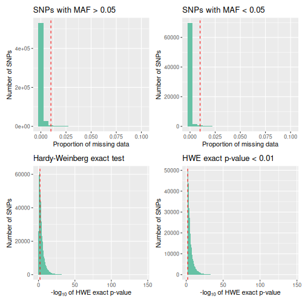
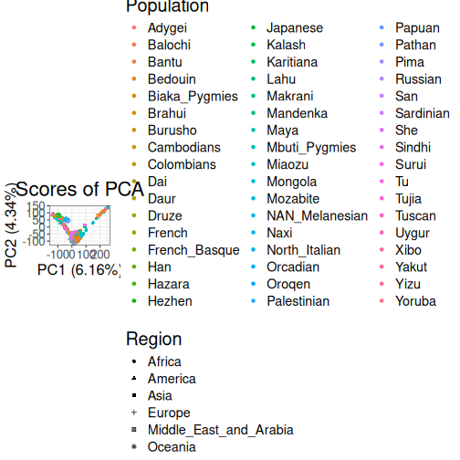
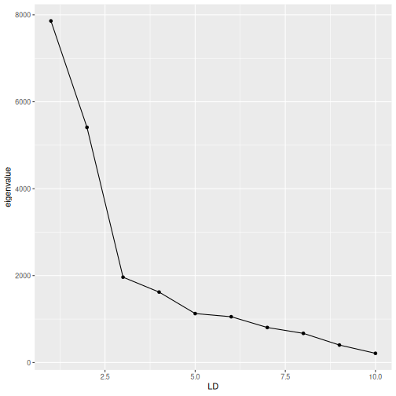

Before running this benchmakr, we need to download into the subdirectory `data`
the bed file `hgdp650.qc.hg19.bed` and the metadata file `HGDPid_populations.txt` from the following link: [HGDP](https://missing_link)


``` r
#load data
bed_path <- "./data/hgdp/hgdp650.qc.hg19.bed"

#load metadata
meta_info <- readr::read_tsv("./data/hgdp/HGDPid_populations.txt")
#> Rows: 1064 Columns: 6
#> ── Column specification ───────────────────────────────────────────────────────────────────────────────────────────
#> Delimiter: "\t"
#> chr (6): Id, Sex, population, Geographic_origin, Region, Pop7Groups
#> 
#> ℹ Use `spec()` to retrieve the full column specification for this data.
#> ℹ Specify the column types or set `show_col_types = FALSE` to quiet this message.
```

#Create gen_tibble object


``` r
hgdp <- gen_tibble(bed_path, quiet = TRUE, backingfile = tempfile("test_"), n_cores = n_cores)
```


#Add metadata


``` r
hgdp <- hgdp %>% mutate(
  population = meta_info$population[match(hgdp$id, meta_info$Id)],region = meta_info$Region[match(hgdp$id, meta_info$Id)]
)
```

#Loci Report


``` r
loci_report <- qc_report_loci(hgdp)
```


#Loci Plot


``` r
autoplot(loci_report, type = "all")
```



``` r

# Save loci report: Figure 1
# ggsave(filename="../results/fig1_hgdp_loci_report.jpg", width=7, height=5, units="in",dpi=350)
```

#Filter Loci


``` r
to_keep_loci <- subset(loci_report,loci_report$maf > 0.05 & loci_report$missingness <0.05)
hgdp <- hgdp %>% select_loci(to_keep_loci$snp_id)
```


#Individual Report


``` r
indiv_report <- qc_report_indiv(hgdp)
```


#Filter individuals


``` r
to_keep_indiv <- which(indiv_report$missingness < 0.1)
hgdp <- hgdp[to_keep_indiv,]
```


#Impute data


``` r
hgdp <- gt_impute_simple(hgdp, method = "mode", n_cores = n_cores)
gt_set_imputed(hgdp, TRUE)
```


#LD clumping


``` r
hgdp <- hgdp %>% select_loci_if(loci_ld_clump(genotypes, thr_r2 = 0.2, n_cores = n_cores))
```


#PCA


``` r
test_pca <- hgdp %>% gt_pca_partialSVD()
```


#Plot PCA


``` r
#plot pca
autoplot(test_pca, type = "scores") +
  aes(color = hgdp$population, shape = hgdp$region) +
    labs(color = "Population", shape = "Region")
```



#DAPC


``` r
pop_factor <- as.factor(hgdp$population)
test_dapc <- gt_dapc(test_pca, pop = pop_factor)
```


#Plot DAPC

``` r
autoplot(test_dapc, type="screeplot")
```



#Calculate Fst


``` r
grouped_hgdp <- hgdp %>% group_by(population)
pairwise_fsts <- grouped_hgdp %>% pairwise_pop_fst(n_cores = n_cores)
```


``` r
timing_pairwise_fst <- tictoc::toc()
#> 6.714 sec elapsed
```


#Save in plink bed format


``` r
gt_as_plink(hgdp,
            file = tempfile(),
            type = "bed",
            overwrite = TRUE)
#> [1] "/tmp/Rtmpi0q1rY/file1ad55da7afd9.bed"
```


#Benchmarking


``` r
print(timing_results)
#> # A tibble: 10 × 2
#>    Analysis_step                   Time_in_Seconds
#>    <chr>                                     <dbl>
#>  1 Read data and create gen_tibble           3.82 
#>  2 QC Loci                                  10.7  
#>  3 QC Individuals                           21.4  
#>  4 Impute Missing Values                     0.199
#>  5 LD Clumping (r2 = 0.2)                    3.81 
#>  6 PCA (k = 10)                              2.17 
#>  7 DAPC (k = 9)                              0.470
#>  8 Calculate pairwise Fst                    6.71 
#>  9 Save to PLINK Format                      0.257
#> 10 Total Time                               49.5
```
