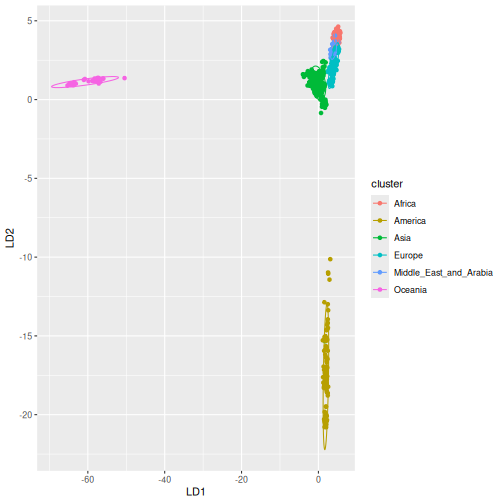
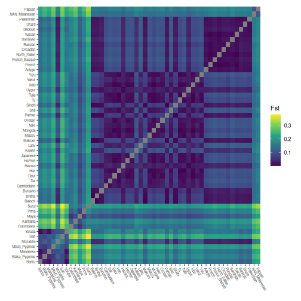

This vignette is a benchmark of a few key functions in the tidypopgen package.
The Human Genome Diversity Project (HGDP) SNP dataset is used for this
benchmark. This dataset includes 1043 individuals from 51 populations, typed
at ~650k loci.

We will run this benchmark on a machine with a GenuineIntel, 13th Gen Intel(R) Core(TM) i9-13900, 24 CPU
and 126 GiB of RAM. However, we will limit the number of
cores used to 20. Parallelised functions within tidypopgen use an
`n_cores` argument for the user to set. However, to prevent a behind-the-scenes
inflation of the number of threads used (for example, in cases where dependency
functions may automatically use all available cores) we need to set up
preferences at the beginning of the session. Specifically, we limit the
number of cores used by the parallelised BLAS library with
`bigparallelr::set_blas_ncores()`, and by the package data.table with
`data.table::setDTthreads()`.


``` r
n_cores <- 20

data.table::setDTthreads(n_cores)
bigparallelr::set_blas_ncores(n_cores)
```

We can now load the necessary libraries:


``` r
library(tidypopgen)
library(ggplot2)
```

And before running the benchmark, we need to download the relevant files. We
can use the following to download the HGDOP files into a temporary directory:


``` r
temp_dir <- tempdir()
download_url <- "https://zenodo.org/records/15582364/files/hgdp650_id_pop.txt"
download_path <- file.path(temp_dir, "hgdp650_id_pop.txt")
download.file(download_url, download_path, mode = "wb")
download_url <- "https://zenodo.org/records/15582364/files/hgdp650.qc.hg19.bed"
download_path <- file.path(temp_dir, "hgdp650.qc.hg19.bed")
download.file(download_url, download_path, method = "wget")
download_url <- "https://zenodo.org/records/15582364/files/hgdp650.qc.hg19.bim"
download_path <- file.path(temp_dir, "hgdp650.qc.hg19.bim")
download.file(download_url, download_path, method = "wget")
download_url <- "https://zenodo.org/records/15582364/files/hgdp650.qc.hg19.fam"
download_path <- file.path(temp_dir, "hgdp650.qc.hg19.fam")
download.file(download_url, download_path, method = "wget")
```

In the following vignette, we place these files into the subdirectory
`data/hgdp/`, and we will use the paths to the bed file `hgdp650.qc.hg19.bed`
and the metadata file `hgdp650_id_pop.txt` to read in our data.


``` r
bed_path <- "./data/hgdp/hgdp650.qc.hg19.bed"
meta_info <- readr::read_tsv("./data/hgdp/hgdp650_id_pop.txt")
#> Rows: 1064 Columns: 6
#> ── Column specification ──────────────────────────────────────────────────────────────────────────────────────────────────
#> Delimiter: "\t"
#> chr (6): Id, Sex, population, Geographic_origin, Region, Pop7Groups
#>
#> ℹ Use `spec()` to retrieve the full column specification for this data.
#> ℹ Specify the column types or set `show_col_types = FALSE` to quiet this message.
```

# Create gen_tibble object

Our first step is to load the HGDP data into a `gen_tibble` object, and add its
associated metadata.


``` r
hgdp <- gen_tibble(bed_path,
  quiet = TRUE,
  backingfile = tempfile("test_"),
  n_cores = n_cores
)
```

read_plink: 2.6s

Add metadata


``` r
hgdp <- hgdp %>% mutate(
  population = meta_info$population[match(hgdp$id, meta_info$Id)],
  region = meta_info$Region[match(hgdp$id, meta_info$Id)]
)
```

Let's confirm that we have read all the expected information:


``` r
hgdp
#> # A gen_tibble: 643733 loci
#> # A tibble:     1,043 × 4
#>    id         genotypes population region
#>    <chr>     <vctr_SNP> <chr>      <chr>
#>  1 HGDP00448          1 Biaka_HG   Africa
#>  2 HGDP00479          2 Biaka_HG   Africa
#>  3 HGDP00985          3 Biaka_HG   Africa
#>  4 HGDP01094          4 Biaka_HG   Africa
#>  5 HGDP00982          5 Mbuti_HG   Africa
#>  6 HGDP00911          6 Mandenka   Africa
#>  7 HGDP01202          7 Mandenka   Africa
#>  8 HGDP00927          8 Yoruba     Africa
#>  9 HGDP00461          9 Biaka_HG   Africa
#> 10 HGDP00451         10 Biaka_HG   Africa
#> # ℹ 1,033 more rows
```

# Loci Report

We can then call `qc_report_loci`. This function supplies minor allele
frequency, rate of missingness, and a Hardy-Weinberg exact p-value for each SNP.


``` r
loci_report <- qc_report_loci(hgdp)
#> This gen_tibble is not grouped. For Hardy-Weinberg equilibrium, `qc_report_loci()` will assume individuals are part of the same population and HWE test p-values will be calculated across all individuals. If you wish to calculate HWE p-values within populations or groups, please use`group_by()` before calling `qc_report_loci()`.
```

loci_report: 1.8s
The resulting report can be observed using `autoplot`.


``` r
autoplot(loci_report, type = "all")
```


# Filter Loci

Following this, we filter the loci to only including those with a minor allele
frequency over 0.05, and a missingness rate below 0.05.


``` r
to_keep_loci <-
  subset(loci_report, loci_report$maf > 0.05 & loci_report$missingness < 0.05)
hgdp <- hgdp %>% select_loci(to_keep_loci$snp_id)
```

filter_loci: 1.5s


# Individual Report

We can then call `qc_report_indiv` to supply observed heterozygosity per
individual, and rate of missingness per individual.


``` r
indiv_report <- qc_report_indiv(hgdp)
```

indiv_report: 2.4s


``` r
autoplot(indiv_report, type = "scatter")
```


# Filter individuals

And we can filter individuals down to only include those with less than 1% of
their genotypes missing.


``` r
to_keep_indiv <- which(indiv_report$missingness < 0.01)
hgdp <- hgdp[to_keep_indiv, ]
```

filter_indiv: 4ms

# Update backingfile

After removing individuals from the dataset, and before imputing, we need to
update the file backing matrix with `gt_update_backingfile`.


``` r
hgdp <- gt_update_backingfile(hgdp)
#> Genetic distances are not sorted, setting them to zero
#>
#> gen_backing files updated, now
#> using bigSNP file: /tmp/RtmppmRPhl/test_11da24e07766_v2.rds
#> with backing file: /tmp/RtmppmRPhl/test_11da24e07766_v2.bk
#> make sure that you do NOT delete those files!
```

# Impute data

Some functions, such as `loci_ld_clump` and the `gt_pca` functions, require that
there is no missingness in the dataset, so we use `gt_impute_simple` to impute
any remaining missing genotypes.


``` r
hgdp <- gt_impute_simple(hgdp, method = "mode", n_cores = n_cores)
gt_set_imputed(hgdp, TRUE)
```

impute: 134ms

# LD clumping

LD clumping is then performed to control for linkage disequilibrium.


``` r
hgdp <- hgdp %>%
  select_loci_if(loci_ld_clump(genotypes, thr_r2 = 0.2, n_cores = n_cores))
```

ld_clumping: 3.6s

# PCA

A principal components analysis can then be computed using the resulting cleaned
and LD clumped dataset.


``` r
test_pca <- hgdp %>% gt_pca_partialSVD()
```

pca: 1.7s

Plot PCA:


``` r
autoplot(test_pca, type = "scores") +
  aes(color = hgdp$region, shape = hgdp$region)
```


# DAPC

We can continue with a discriminant analysis of principal
components using `gt_dapc`, setting 6 groups corresponding to
the main geographic regions covered by the dataset.


``` r
test_dapc <- gt_dapc(test_pca, pop = as.factor(hgdp$region))
```

dapc: 35ms

Plot DAPC:


``` r
autoplot(test_dapc, type = "scores")
```



# Calculate Fst

To examine the differentiation between populations in the global HGDP set, we
calculate pairwise Fst.


``` r
grouped_hgdp <- hgdp %>% group_by(population)
pairwise_fsts <- grouped_hgdp %>% pairwise_pop_fst(
  n_cores = n_cores,
  type = "pairwise"
)
```

pairwise_fst: 3.5s

Plot pairwise Fst:


``` r
# Order by continents
grouped_hgdp_order <- grouped_hgdp %>% arrange(region, population)
regional_order <- unique(grouped_hgdp_order$population)
pairwise_fsts <- pairwise_fsts[regional_order, regional_order]

ggheatmap(pairwise_fsts) +
  scale_fill_viridis_c() +
  theme(
    axis.text.x = element_text(angle = -60, hjust = 0, size = 6),
    axis.text.y = element_text(angle = 0, hjust = 1, size = 6)
  ) +
  labs(
    x = element_blank(),
    y = element_blank(),
    fill = "Fst"
  )
```



# Save in plink bed format

Finally, we can save the resulting cleaned dataset to a PLINK .bed file.


``` r
gt_as_plink(hgdp,
  file = tempfile(),
  type = "bed",
  overwrite = TRUE
)
#> [1] "/tmp/RtmppmRPhl/file11da6e81448a.bed"
```

plink_save: 246ms

# Summary

Here is a summary of the time taken (in seconds) to perform each step of the analyses:


```
#>            step  time
#> 1    read_plink  2.61
#> 2   loci_report  1.83
#> 3   filter_loci  1.53
#> 4  indiv_report  2.42
#> 5  filter_indiv     0
#> 6        impute  0.13
#> 7   ld_clumping  3.65
#> 8           pca  1.71
#> 9          dapc  0.03
#> 10 pairwise_fst  3.48
#> 11   plink_save  0.25
#> 12        Total 17.64
```
# Running the benchmark on a laptop
We will now run this benchmark on a laptop 
with a GenuineIntel, Intel(R) Core(TM) Ultra 7 155H, 22 CPU
and 31 GiB
of RAM, limiting the number of cores to 4.
Here is a summary of the time taken (in seconds) to perform each step of the analyses:


```
#>            step  time
#> 1    read_plink  4.68
#> 2   loci_report  3.18
#> 3   filter_loci   3.2
#> 4  indiv_report  3.27
#> 5  filter_indiv     0
#> 6        impute  0.88
#> 7   ld_clumping  9.28
#> 8           pca  3.74
#> 9          dapc  0.06
#> 10 pairwise_fst  5.49
#> 11   plink_save  0.34
#> 12        Total 34.12
```
