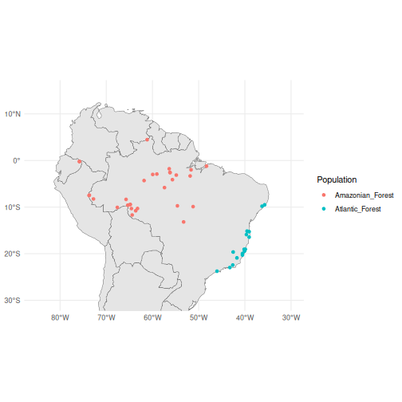
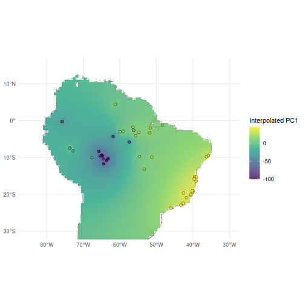

In this vignette, we will demonstrate how to interpolate principal component scores
across geographic space using the tidypopgen integration with the `sf` package.

To do so, we will use a dataset of *Anolis punctatus* lizards from South America,
introduced in the vignette 'Population genetic analysis with tidypopgen'. For a full analysis of this dataset using `tidypopgen`, and details on how to download the data, please refer to this previous vignette.

Let's begin by reading in the data and attaching the metadata:


``` r
library(tidypopgen)
vcf_path <-
  system.file("/extdata/anolis/punctatus_t70_s10_n46_filtered.recode.vcf.gz",
    package = "tidypopgen"
  )
anole_gt <-
  gen_tibble(vcf_path, quiet = TRUE, backingfile = tempfile("anolis_"))

pops_path <- system.file("/extdata/anolis/punctatus_n46_meta.csv",
  package = "tidypopgen"
)
pops <- read.csv(pops_path)
anole_gt <- anole_gt %>% left_join(pops, by = "id")
```

And we can check our data using:


``` r
anole_gt %>% glimpse()
#> Rows: 46
#> Columns: 6
#> A tibble: 46 × 6
#> $ id         <chr> "punc_BM288", "punc_GN71", "punc_H1907", "punc_H1911", "punc_H2546", "punc_IBSPCRIB036…
#> $ genotypes  <vctr_SNP> [0,0,...], [2,0,...], [0,2,...], [0,2,...], [0,1,...], [0,0,...], [0,0,...], [0,0…
#> $ population <chr> "Amazonian_Forest", "Amazonian_Forest", "Amazonian_Forest", "Amazonian_Forest", "Amazo…
#> $ longitude  <dbl> -51.8448, -54.6064, -64.8247, -64.8203, -65.3576, -46.0247, -36.2838, -40.5219, -40.52…
#> $ latitude   <dbl> -3.3228, -9.7307, -9.4459, -9.4358, -9.5979, -23.7564, -9.8092, -20.2811, -19.9600, -1…
#> $ pop        <chr> "Eam", "Eam", "Wam", "Wam", "Wam", "AF", "AF", "AF", "AF", "AF", "Wam", "Wam", "Eam", …
```

## Map

`tidypopgen` integrates with the `sf` package to allow swift and easy spatial analyses and mapping of genetic data. To begin, we can add `sf` geometry to our `gen_tibble` using `gt_add_sf()`. We need to specify the names of the columns containing the longitude and latitude coordinates.


``` r
anole_gt <- gt_add_sf(anole_gt, c("longitude", "latitude"))
anole_gt
#> Simple feature collection with 46 features and 6 fields
#> Geometry type: POINT
#> Dimension:     XY
#> Bounding box:  xmin: -75.8069 ymin: -23.7564 xmax: -35.7099 ymax: 4.4621
#> Geodetic CRS:  WGS 84
#> # A gen_tibble: 3249 loci
#> # A tibble:     46 × 7
#>    id                 genotypes population       longitude latitude pop              geometry
#>    <chr>             <vctr_SNP> <chr>                <dbl>    <dbl> <chr>         <POINT [°]>
#>  1 punc_BM288         [0,0,...] Amazonian_Forest     -51.8    -3.32 Eam    (-51.8448 -3.3228)
#>  2 punc_GN71          [2,0,...] Amazonian_Forest     -54.6    -9.73 Eam    (-54.6064 -9.7307)
#>  3 punc_H1907         [0,2,...] Amazonian_Forest     -64.8    -9.45 Wam    (-64.8247 -9.4459)
#>  4 punc_H1911         [0,2,...] Amazonian_Forest     -64.8    -9.44 Wam    (-64.8203 -9.4358)
#>  5 punc_H2546         [0,1,...] Amazonian_Forest     -65.4    -9.60 Wam    (-65.3576 -9.5979)
#>  6 punc_IBSPCRIB0361  [0,0,...] Atlantic_Forest      -46.0   -23.8  AF    (-46.0247 -23.7564)
#>  7 punc_ICST764       [0,0,...] Atlantic_Forest      -36.3    -9.81 AF     (-36.2838 -9.8092)
#>  8 punc_JFT459        [0,0,...] Atlantic_Forest      -40.5   -20.3  AF    (-40.5219 -20.2811)
#>  9 punc_JFT773        [0,0,...] Atlantic_Forest      -40.5   -20.0  AF        (-40.52 -19.96)
#> 10 punc_LG1299        [0,0,...] Atlantic_Forest      -39.1   -15.3  AF    (-39.0694 -15.2696)
#> # ℹ 36 more rows
```

We can then create a map of South America using the
`rnaturalearth` package. This will be the base map onto which we will plot our samples and interpolate our PC scores.


``` r
library(rnaturalearth)
library(ggplot2)

map <- ne_countries(
  continent = "South America",
  type = "map_units", scale = "medium"
)

ggplot() +
  geom_sf(data = map) +
  geom_sf(data = anole_gt$geometry, aes(colour = anole_gt$population)) +
  coord_sf(
    xlim = c(-85, -30),
    ylim = c(-30, 15)
  ) +
  theme_minimal() +
  guides(colour = guide_legend(title = "Population"))
```



# PCA

Our previous vignette used PCA, DAPC, and ADMIXTURE to show that this sample of *Anolis punctatus* lizards contains three main genetic clusters across the range of the species. Suppose that we wanted to interpolate the first principal component across the range of the species to observe the change in genetic variation across space.

Let's run a PCA and augment the gen_tibble with the principal component scores.


``` r
anole_gt <- gt_impute_simple(anole_gt, method = "mode")
anole_pca <- anole_gt %>% gt_pca_partialSVD(k = 30)
anole_gt <- augment(anole_pca, data = anole_gt)
```

# Interpolating

Now that we have a map and our genetic data with PCA scores, we can interpolate the scores of the first principal component across the landscape.

To begin with, we will need to load the `sf`, `terra`, and `tidyterra` packages.


``` r
library(sf)
library(terra)
library(tidyterra)
```

We will first prepare the map by unifying all geometries into a single polygon and casting it to "POLYGON" type.


``` r
map <- st_union(map) %>% st_sf()
map <- st_cast(map, "POLYGON")
```

The, we need to create a grid of points covering the area of the map.


``` r
grid <- rast(map, nrows = 100, ncols = 100)
xy <- xyFromCell(grid, 1:ncell(grid))
```

By converting this grid to an `sf` object, we can then use `st_filter()` to keep only the points that fall within the landmass.


``` r
coop <- st_as_sf(as.data.frame(xy), coords = c("x", "y"),
                 crs = st_crs(map))
coop <- st_filter(coop, map)
```

Now we can use the `gstat` package to perform spatial interpolation of heterozygosity.

`gstat` implements several methods for spatial interpolation, including inverse distance weighting (IDW) and kriging. Here, we will use IDW to interpolate heterozygosity across our grid of points.

We remove the genotypes from our `gen_tibble`, as `gstat` does not accept a `gen_tibble` object, and then run the interpolation:


``` r
anole_sf_obj <- anole_gt %>% select(-"genotypes")

library(gstat)
res <- gstat(formula = .fittedPC1 ~ 1, locations = anole_sf_obj,
             nmax = nrow(anole_sf_obj),
             set = list(idp = 1))

resp <- predict(res, coop)
#> [inverse distance weighted interpolation]
resp$x <- st_coordinates(resp)[,1]
resp$y <- st_coordinates(resp)[,2]
```

We can rasterize the interpolated values:


``` r
pred <- rasterize(resp, grid, field = "var1.pred", fun = "mean")
```

And for a publication-ready figure, we can use `ggplot2` and the `tidyterra` package to plot:


``` r
ggplot()  +
  geom_sf(data = map, fill = "grey95")  +
  geom_spatraster(data = pred, aes(fill = mean))+
  geom_sf(data = anole_gt$geometry, aes(fill = anole_gt$.fittedPC1), 
          shape = 21, colour = "black", size = 2, stroke = 0.3) +
  coord_sf(
    xlim = c(-85, -30),
    ylim = c(-30, 15)
  ) +
  scale_fill_viridis_c(name = "Interpolated PC1", alpha= 0.8, na.value = NA) +
  scale_color_viridis_c(name = "Observed", alpha= 0.8) +
  theme_minimal()
```



From our interpolated map, we can see the clear gradient in the first principal component scores across the range of *Anolis punctatus*, with the highest scores among Atlantic forest populations in the east, and the lowest scores clustered among Amazonian populations in the west.
