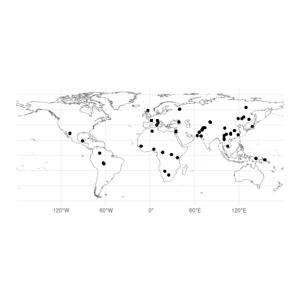
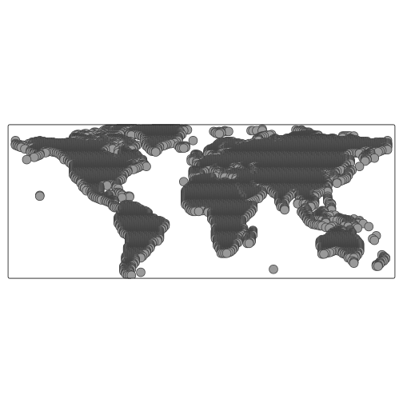
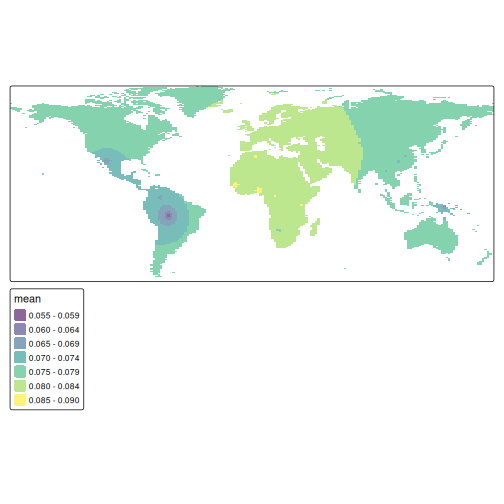

In this vignette, we will demonstrate how to interpolate measures of genetic diversity
across geographic space using the tidypopgen integration with the `sf` package.

To do so, we will use the Human Genome Diversity Project (HGDP) dataset.

The data files can be downloaded using the following code:


``` r
temp_dir <- tempdir()
download_url <-
  "https://zenodo.org/records/17375732/files/hgdp650_id_pop_coords.txt"
download_path <- file.path(temp_dir, "hgdp650_id_pop.txt")
download.file(download_url, download_path, mode = "wb")
download_url <- "https://zenodo.org/records/17375732/files/hgdp650.qc.hg19.bed"
download_path <- file.path(temp_dir, "hgdp650.qc.hg19.bed")
download.file(download_url, download_path, method = "wget")
download_url <- "https://zenodo.org/records/17375732/files/hgdp650.qc.hg19.bim"
download_path <- file.path(temp_dir, "hgdp650.qc.hg19.bim")
download.file(download_url, download_path, method = "wget")
download_url <- "https://zenodo.org/records/17375732/files/hgdp650.qc.hg19.fam"
download_path <- file.path(temp_dir, "hgdp650.qc.hg19.fam")
download.file(download_url, download_path, method = "wget")
```

# Create gen_tibble object

Our first step is to load the HGDP data into a `gen_tibble` object.


``` r
bed_path <- "./data/hgdp/hgdp650.qc.hg19.bed"

hgdp <- gen_tibble(bed_path,
  quiet = TRUE,
  backingfile = tempfile("test_")
)
```

And add its associated metadata


``` r
meta_info <- read_tsv("./data/hgdp/hgdp650_id_pop_coords.txt", col_names = TRUE)
#> Rows: 1043 Columns: 6
#> ── Column specification ───────────────────────────────────────────────────────────────────────────────────
#> Delimiter: "\t"
#> chr (4): id, population, geographic_origin, region
#> dbl (2): latitude, longitude
#> 
#> ℹ Use `spec()` to retrieve the full column specification for this data.
#> ℹ Specify the column types or set `show_col_types = FALSE` to quiet this message.

hgdp <- hgdp %>% mutate(
  population = meta_info$population[match(hgdp$id, meta_info$id)],
  geographic_origin = meta_info$geographic_origin[match(hgdp$id, meta_info$id)],
  region = meta_info$region[match(hgdp$id, meta_info$id)],
  latitude = meta_info$latitude[match(hgdp$id, meta_info$id)],
  longitude = meta_info$longitude[match(hgdp$id, meta_info$id)]
)
```

Let's confirm that we have all the expected information:


``` r
hgdp
#> # A gen_tibble: 643733 loci
#> # A tibble:     1,043 × 8
#>    id        phenotype  genotypes population geographic_origin            region latitude longitude
#>    <chr>     <fct>     <vctr_SNP> <chr>      <chr>                        <chr>     <dbl>     <dbl>
#>  1 HGDP00448 control    [2,0,...] Biaka_HG   Central_African_Republic     Africa        4        17
#>  2 HGDP00479 control    [1,0,...] Biaka_HG   Central_African_Republic     Africa        4        17
#>  3 HGDP00985 control    [0,0,...] Biaka_HG   Central_African_Republic     Africa        4        17
#>  4 HGDP01094 control    [1,0,...] Biaka_HG   Central_African_Republic     Africa        4        17
#>  5 HGDP00982 control    [2,0,...] Mbuti_HG   Democratic_Republic_of_Congo Africa        1        29
#>  6 HGDP00911 control    [1,0,...] Mandenka   Senegal                      Africa       12       -12
#>  7 HGDP01202 control    [2,0,...] Mandenka   Senegal                      Africa       12       -12
#>  8 HGDP00927 control    [2,0,...] Yoruba     Nigeria                      Africa        8         5
#>  9 HGDP00461 control    [2,0,...] Biaka_HG   Central_African_Republic     Africa        4        17
#> 10 HGDP00451 control    [2,0,...] Biaka_HG   Central_African_Republic     Africa        4        17
#> # ℹ 1,033 more rows
```

# Gen_tibble with sf

Now that we have latitudes and
longitudes in our tibble; we can transform them into an `sf` geometry with the
function `gt_add_sf()`. Once we have done that, our `gen_tibble` will act as
an `sf` object, which can be plotted with `ggplot2`.


``` r
hgdp <- gt_add_sf(hgdp, c("longitude", "latitude"))
hgdp
#> Simple feature collection with 1043 features and 8 fields
#> Geometry type: POINT
#> Dimension:     XY
#> Bounding box:  xmin: -108 ymin: -25.83333 xmax: 155 ymax: 63
#> Geodetic CRS:  WGS 84
#> # A gen_tibble: 643733 loci
#> # A tibble:     1,043 × 9
#>    id        phenotype  genotypes population geographic_origin            region latitude longitude
#>    <chr>     <fct>     <vctr_SNP> <chr>      <chr>                        <chr>     <dbl>     <dbl>
#>  1 HGDP00448 control    [2,0,...] Biaka_HG   Central_African_Republic     Africa        4        17
#>  2 HGDP00479 control    [1,0,...] Biaka_HG   Central_African_Republic     Africa        4        17
#>  3 HGDP00985 control    [0,0,...] Biaka_HG   Central_African_Republic     Africa        4        17
#>  4 HGDP01094 control    [1,0,...] Biaka_HG   Central_African_Republic     Africa        4        17
#>  5 HGDP00982 control    [2,0,...] Mbuti_HG   Democratic_Republic_of_Congo Africa        1        29
#>  6 HGDP00911 control    [1,0,...] Mandenka   Senegal                      Africa       12       -12
#>  7 HGDP01202 control    [2,0,...] Mandenka   Senegal                      Africa       12       -12
#>  8 HGDP00927 control    [2,0,...] Yoruba     Nigeria                      Africa        8         5
#>  9 HGDP00461 control    [2,0,...] Biaka_HG   Central_African_Republic     Africa        4        17
#> 10 HGDP00451 control    [2,0,...] Biaka_HG   Central_African_Republic     Africa        4        17
#> # ℹ 1,033 more rows
#> # ℹ 1 more variable: geometry <POINT [°]>
```

# Interpolating heterozygosity


``` r
library(spData)
library(sf)
library(terra)
library(tmap)
library(viridis)
```

Calculating heterozygosity is simple in `tidypopgen`. First, lets run some basic filtering to remove SNPs in linkage:


``` r
hgdp <- gt_impute_simple(hgdp)
to_keep <- hgdp %>% loci_ld_clump(
  thr_r2 = 0.2, size = 100,
  return_id = TRUE, use_positions = TRUE
)
hgdp <- hgdp %>% select_loci(all_of(to_keep))
```

We can store heterozygosity for each individual in our gen_tibble object by creating a column with `mutate()` and using the function `indiv_het_obs()` to calculate observed heterozygosity for each individual. Then we can create a new column with the mean heterozygosity for each population


``` r
hgdp <- hgdp %>% mutate(heterozygosity = indiv_het_obs(genotypes))
mean_het <- hgdp %>%
  group_by(population) %>%
  summarise(mean_het = mean(heterozygosity))
hgdp <-
  hgdp %>%
  mutate(mean_het = mean_het$mean_het[match(
    hgdp$population,
    mean_het$population
  )])
```

We can then begin by creating a global map using `rnaturalearth`.


``` r
library(rnaturalearth)

map <- ne_countries(scale = "medium") %>%
  filter(sovereignt != "Antarctica")
map <- st_union(map) %>% st_sf()
map <- st_cast(map, "POLYGON")
map <- st_wrap_dateline(map, options = c("WRAPDATELINE=YES"))
```

We can check the distribution of our samples across the map using our `gen_tibble` with `sf` geometry:


``` r
ggplot() +
  geom_sf(data = hgdp$geometry) +
  geom_sf(data = map, fill = NA) +
  theme_minimal()
```



Our map shows the distribution of the HGDP data, but we can see that there are gaps in the sampling. We know that heterozygosity decreases with distance from Africa, so we can use spatial interpolation to estimate heterozygosity in unsampled areas.

To begin, we will create a grid of points covering the map.


``` r
grid <- rast(map, nrows = 200, ncols = 200)
xy <- xyFromCell(grid, 1:ncell(grid))
```

By converting this grid to an `sf` object, we can then use `st_filter()` to keep only the points that fall within the landmasses.


``` r
coop <- st_as_sf(as.data.frame(xy),
  coords = c("x", "y"),
  crs = st_crs(map)
)
coop <- st_filter(coop, map)
```

And we can quickly visualise this grid using the `qtm` autoplotting function from the `tmap` package:


``` r
qtm(coop)
```



Now we can use the `gstat` package to perform spatial interpolation of heterozygosity.

`gstat` implements several methods for spatial interpolation, including inverse distance weighting (IDW) and kriging. Here, we will use IDW to interpolate heterozygosity across our grid of points.

We remove the genotypes from our `gen_tibble`, as `gstat` does not accept a `gen_tibble` object, and then run the interpolation:


``` r
hgdp_sf_obj <- hgdp %>% select(-"genotypes")

library(gstat)
res <- gstat(
  formula = mean_het ~ 1, locations = hgdp_sf_obj,
  nmax = nrow(hgdp_sf_obj),
  set = list(idp = 1)
)

resp <- predict(res, coop)
#> [inverse distance weighted interpolation]
resp$x <- st_coordinates(resp)[, 1]
resp$y <- st_coordinates(resp)[, 2]
```

We can visualise the interpolated values using `tmap`:


``` r
pred <- rasterize(resp, grid, field = "var1.pred", fun = "mean")
tm_shape(pred) + tm_raster(alpha = 0.6, palette = "viridis")
#> 
#> ── tmap v3 code detected ──────────────────────────────────────────────────────────────────────────────────
#> [v3->v4] `tm_tm_raster()`: migrate the argument(s) related to the scale of the visual variable `col`
#> namely 'palette' (rename to 'values') to col.scale = tm_scale(<HERE>).
#> [v3->v4] `tm_raster()`: use `col_alpha` instead of `alpha`.
```



Or, for a more publication-ready figure, we can use `ggplot2` and the `tidyterra` package:


``` r
library(tidyterra)

ggplot() +
  geom_sf(data = hgdp, aes(colour = mean_het)) +
  geom_spatraster(data = pred, aes(fill = var1.pred)) +
  scale_fill_viridis_c(
    name = "Interpolated Heterozygosity",
    alpha = 0.8,
    na.value = NA
  ) +
  scale_color_viridis_c(name = "Observed", alpha = 0.8) +
  theme_minimal()
#> Error in `geom_spatraster()`:
#> ! Problem while computing aesthetics.
#> ℹ Error occurred in the 2nd layer.
#> Caused by error:
#> ! object 'var1.pred' not found
```
